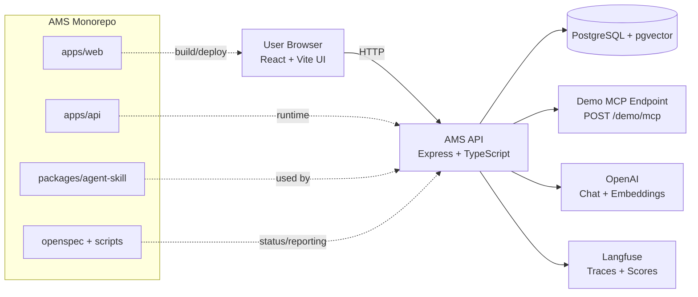
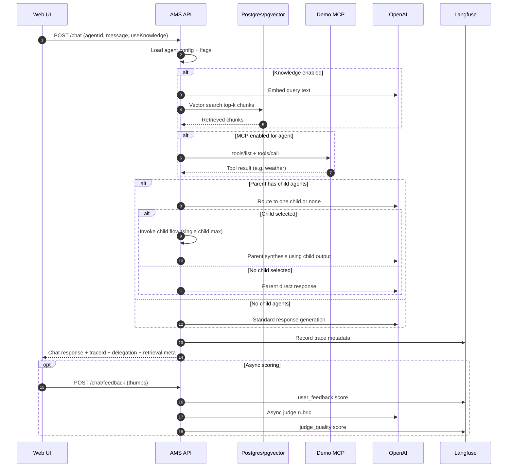
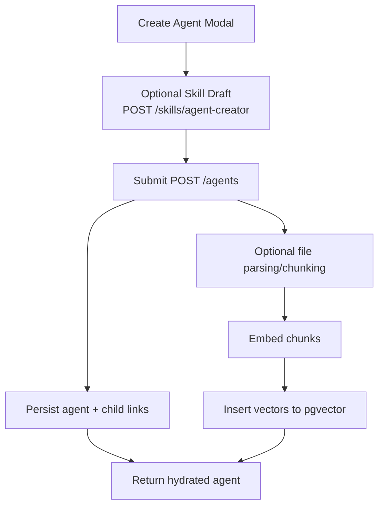

# AMS Architecture Diagram

This diagram shows the high-level runtime flow and key integrations.

## 1) System Topology

## 2) Chat Execution Flow (with RAG + MCP + Parent/Child)

## 3) Agent Creation Flow

## Notes

- Parent-child orchestration is feature-flagged via `ENABLE_CHILD_ORCHESTRATION`.
- Routing mode can be `llm_strict` or `hybrid` via `CHILD_ROUTING_MODE`.
- RAG behavior is tunable with `RAG_TOP_K`, `RAG_MIN_SIMILARITY`, `RAG_CHUNK_SIZE`, `RAG_CHUNK_OVERLAP`.
